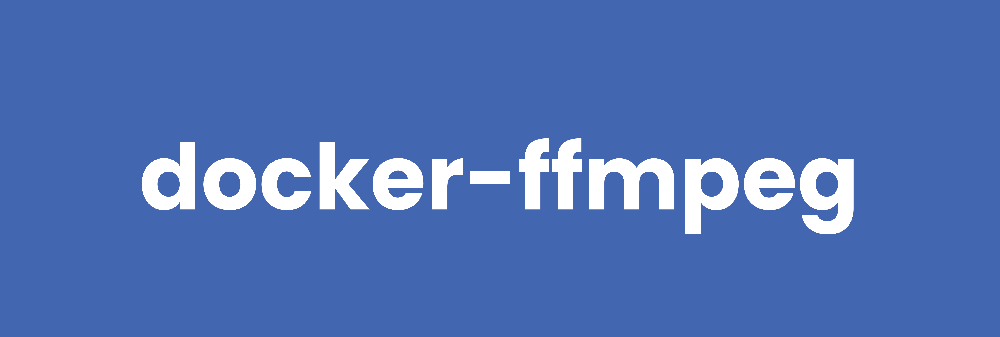

# docker-ffmpeg



[](https://github.com/RagedUnicorn/docker-ffmpeg/actions/workflows/docker_release.yml)


> Docker Alpine image with FFmpeg and its dependencies.


## Overview

This Docker image provides a lightweight FFmpeg installation built from source on Alpine Linux. It includes a comprehensive set of codecs and libraries for versatile media processing capabilities.

## Features

- **Small footprint**: ~70-80MB runtime image using Alpine Linux
- **FFmpeg 7.1.1**: Latest stable version compiled from source
- **Extensive codec support**: x264, x265, VP9, Opus, MP3, AAC, and more
- **Multi-stage build**: Optimized for minimal final image size
- **Volume mounting**: Easy file input/output through `/tmp/workdir`

## Building the Image

```bash
docker build -t ragedunicorn/ffmpeg .
```

## Usage

The container uses FFmpeg as the entrypoint, so any FFmpeg parameters can be passed directly to the `docker run` command.

### Basic Usage

```bash
# Using latest version
docker run -v $(pwd):/tmp/workdir ragedunicorn/ffmpeg:latest [ffmpeg-options]

# Using specific FFmpeg version (latest Alpine build)
docker run -v $(pwd):/tmp/workdir ragedunicorn/ffmpeg:7.1.1 [ffmpeg-options]

# Using exact version combination
docker run -v $(pwd):/tmp/workdir ragedunicorn/ffmpeg:7.1.1-alpine3.22.0-1 [ffmpeg-options]
```

### Examples

#### Convert Video Format
```bash
docker run -v $(pwd):/tmp/workdir ragedunicorn/ffmpeg:latest -i input.mp4 -c:v libx264 -c:a aac output.mp4
```

#### Get Video Information
```bash
docker run -v $(pwd):/tmp/workdir ragedunicorn/ffmpeg:latest -i input.mp4
```

#### Extract Audio
```bash
docker run -v $(pwd):/tmp/workdir ragedunicorn/ffmpeg:latest -i input.mp4 -vn -acodec mp3 output.mp3
```

#### Resize Video
```bash
docker run -v $(pwd):/tmp/workdir ragedunicorn/ffmpeg:latest -i input.mp4 -vf scale=1280:720 output.mp4
```

#### Convert to WebM
```bash
docker run -v $(pwd):/tmp/workdir ragedunicorn/ffmpeg:latest -i input.mp4 -c:v libvpx -c:a libvorbis output.webm
```

#### Create GIF from Video
```bash
docker run -v $(pwd):/tmp/workdir ragedunicorn/ffmpeg:latest -i input.mp4 -vf "fps=10,scale=320:-1" output.gif
```

## Supported Codecs

### Video Codecs
- H.264 (libx264)
- H.265/HEVC (libx265)
- VP8/VP9 (libvpx)
- Theora (libtheora)

### Audio Codecs
- AAC (libfdk-aac)
- MP3 (libmp3lame)
- Opus (libopus)
- Vorbis (libvorbis)

### Additional Features
- Subtitles (libass)
- Text rendering (libfreetype)
- WebP support (libwebp)
- RTMP streaming (librtmp)
- SSL/TLS support (openssl)

## Versioning

This project uses semantic versioning that matches the Docker image contents:

**Git Tag Format:** `v{ffmpeg_version}-alpine{alpine_version}-{build_number}`
**Docker Tag Format:** `{ffmpeg_version}-alpine{alpine_version}-{build_number}` (without 'v' prefix)

**Examples:**
- Git tag: `v7.1.1-alpine3.22.0-1` → Docker tag: `7.1.1-alpine3.22.0-1`
- Git tag: `v7.1.1-alpine3.22.0-2` → Docker tag: `7.1.1-alpine3.22.0-2` (rebuild)
- Git tag: `v7.1.1-alpine3.22.1-1` → Docker tag: `7.1.1-alpine3.22.1-1` (Alpine update)
- Git tag: `v7.1.2-alpine3.22.0-1` → Docker tag: `7.1.2-alpine3.22.0-1` (FFmpeg update)

**Creating a Release:**
```bash
git tag v7.1.1-alpine3.22.0-1
git push origin v7.1.1-alpine3.22.0-1
```

This will automatically:
- Build and push Docker images with the corresponding tags
- Create a GitHub release
- Tag images on both GitHub Container Registry and Docker Hub

## Automated Dependency Updates

This project uses [Renovate](https://docs.renovatebot.com/) to automatically check for updates to:
- Alpine Linux base image version (all major, minor, and patch updates)
- FFmpeg version

Renovate runs weekly (every Monday) and creates pull requests when updates are available. The configuration tracks 
both Alpine Linux and FFmpeg releases, creating separate pull requests for each update.

# License

MIT License

Copyright (c) 2025 Michael Wiesendanger

Permission is hereby granted, free of charge, to any person obtaining
a copy of this software and associated documentation files (the
"Software"), to deal in the Software without restriction, including
without limitation the rights to use, copy, modify, merge, publish,
distribute, sublicense, and/or sell copies of the Software, and to
permit persons to whom the Software is furnished to do so, subject to
the following conditions:

The above copyright notice and this permission notice shall be
included in all copies or substantial portions of the Software.

THE SOFTWARE IS PROVIDED "AS IS", WITHOUT WARRANTY OF ANY KIND,
EXPRESS OR IMPLIED, INCLUDING BUT NOT LIMITED TO THE WARRANTIES OF
MERCHANTABILITY, FITNESS FOR A PARTICULAR PURPOSE AND
NONINFRINGEMENT. IN NO EVENT SHALL THE AUTHORS OR COPYRIGHT HOLDERS BE
LIABLE FOR ANY CLAIM, DAMAGES OR OTHER LIABILITY, WHETHER IN AN ACTION
OF CONTRACT, TORT OR OTHERWISE, ARISING FROM, OUT OF OR IN CONNECTION
WITH THE SOFTWARE OR THE USE OR OTHER DEALINGS IN THE SOFTWARE.
